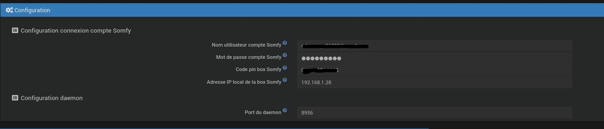
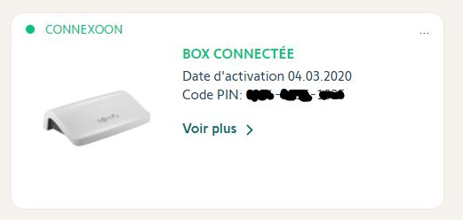
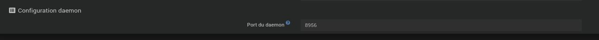
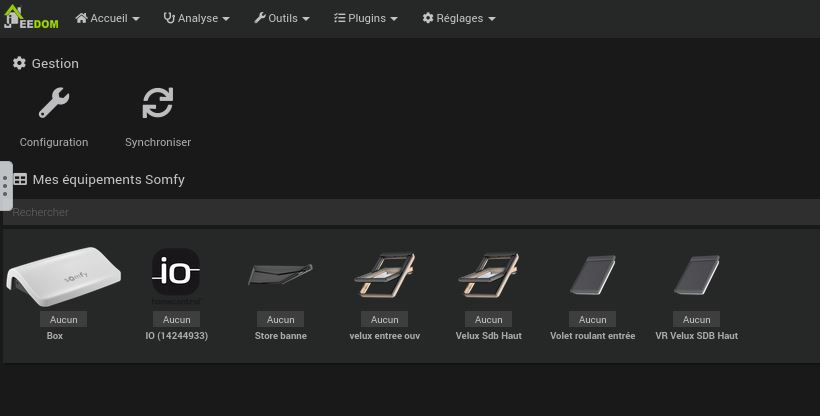
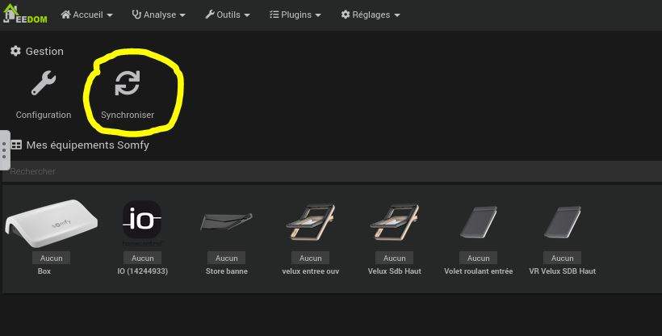
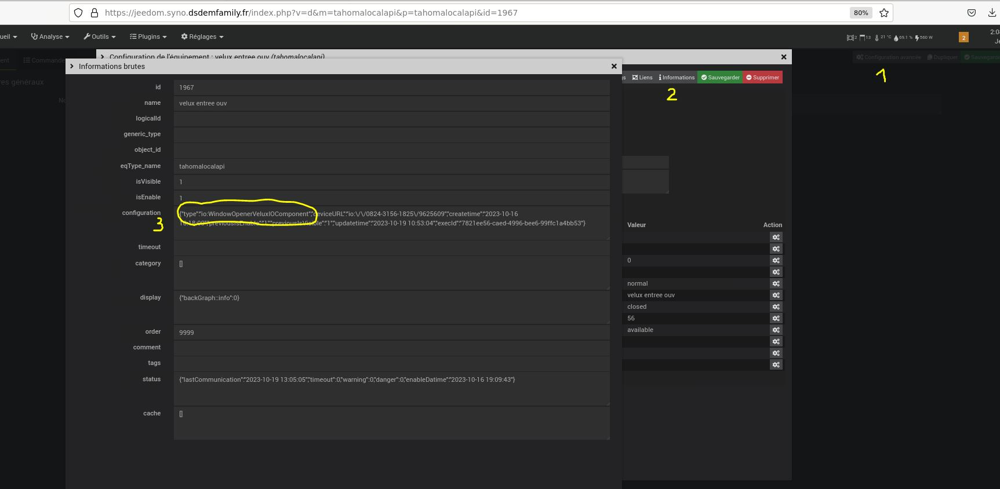

# Plugin tahomalocalapi

Ce plugin permet de communiquer en local avec les box Somfy compatible avec le mode développeur.

Prérequis
---
Activer le mode développeur sur sa box Somfy, pour se faire rendez-vous sur le site Internet de Somfy (https://www.somfy.fr/se-connecter) et connectez-vous à votre compte. 
Toujours via le site, accédez à votre box et activez le mode développeur.

Si le mode développeur n'est pas disponible regardez si vous n'avez pas une MAJ de celle-ci en attente.

Paramétrage du plugin
---
Le plugin doit se connecter à votre box, il a donc besoin  
* devos identifiants / mot de passe
* d'infortmations liées à votre box
** adresse ip locale
** code pin 

Le plugin utilise également un daemon pour fonctionner, il faut donc définir un port  en vérifiant bien qu'il n'est pas utilisé au travers d'un autre plugin

Ne pas oublier de sauvegarder votre configuration sinon le daemon n'aura pas les informations nécessaires pour démarrer correctement.

Il faut également penser à le lancer manuellemet.

Vous pouvez dès à présent lancer le daemon.
Celui va se connecter, à l'aide de vos identifiants / mot de passe à une api pour générer un token.
Ce token servira par la suite à interargir avec votre box en local.

A chaque redémarrage du daemon l'intégralité des équipements sont scannés, récupérés et crées automatiquement.

Si jamais vous intégrez un nouvel équipement à votre box, pas besoin de relancer le daemon... lancez une synchronisation directement depuis cette meme page.

Tips
---
Les images des équipements sont stockées sous /plugins/tahomalocalapi/data/img
Mais si des images ne vous conviennent pas ou sont manquantes vous pouvez surcharger celle défini de base dans le plugin.
Pour ce faire vous devez 
* récupérer le type de l'équipement (configuration avancée / information / configutation -> type)

* déposé l'image souhaitée sous /plugins/tahomalocalapi/data/img/custom avec pour nom le type d'équipement récupéré sans le "io:" et au format png

